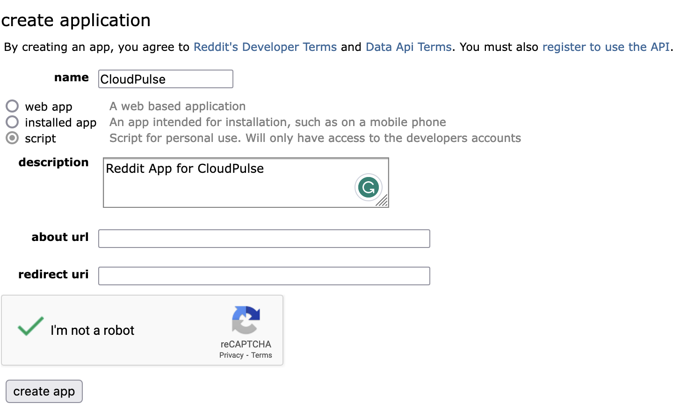

# Creating a Reddit Bot

Reddit bots are automated scripts that interact with Reddit's API to perform various tasks. To create a Reddit bot and obtain the required credentials (Client ID and Client Secret) for the `config.ini`, follow these steps:

## Step 1: Create a Reddit Account

If you don't have a Reddit account, create one by visiting [Reddit's Sign Up page](https://www.reddit.com/register). Make sure to choose a unique username and a secure password.

## Step 2: Enable Developer Options

1. Log in to your Reddit account.
2. Visit the [Reddit Apps page](https://www.reddit.com/prefs/apps).
3. Scroll down to the `Developed Applications` section.

## Step 3: Create a New Application

1. Click on the `Create App` or `Create Another App` button.
2. Fill in the required fields:
   - **name**: Choose a name for your bot.
   - **App type**: Select `script` for a bot.
   - **description**: Add a brief description of your bot.
   - **about url**: You can leave this blank or provide a link to more information about your bot.
   - **permissions**: Select the necessary permissions for your bot (usually `read` is sufficient).

3. In the `redirect uri` field, enter `http://localhost:8080` (this is a placeholder, and we won't use it for script-type apps).

4. Check the box to agree to the terms.

5. Click `Create app` to generate your bot's Client ID and Client Secret.

## Step 4: Retrieve Client ID and Client Secret

Once your app is created, you'll see the following information:
- **client ID**: This is your bot's unique identifier.
- **client secret**: This is a secret key that should be kept confidential.

Copy the Client ID and Client Secret and save them in a secure location. Do not share your Client Secret with anyone or include it directly in your code.

Remember to keep your credentials secure and never expose them publicly, as they grant access to your bot's Reddit account.
